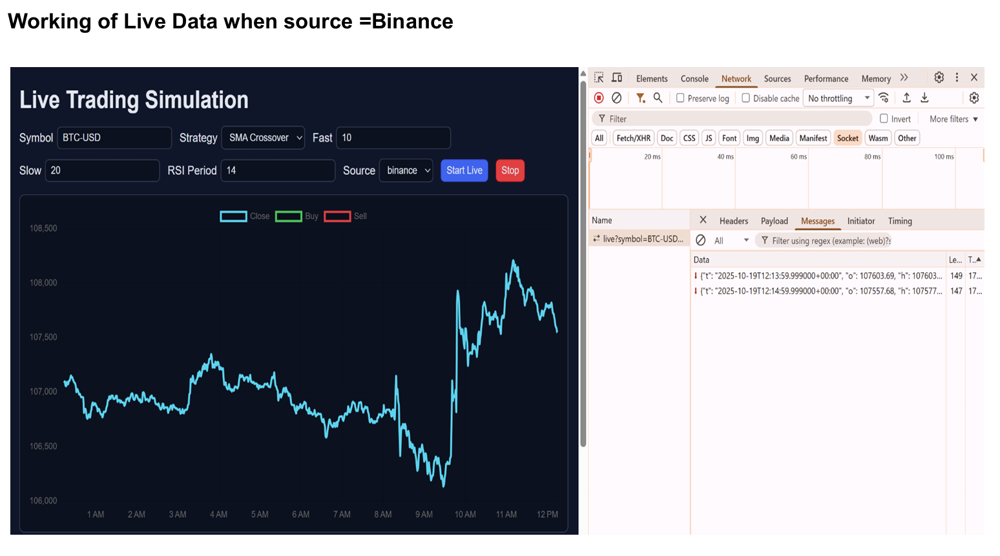
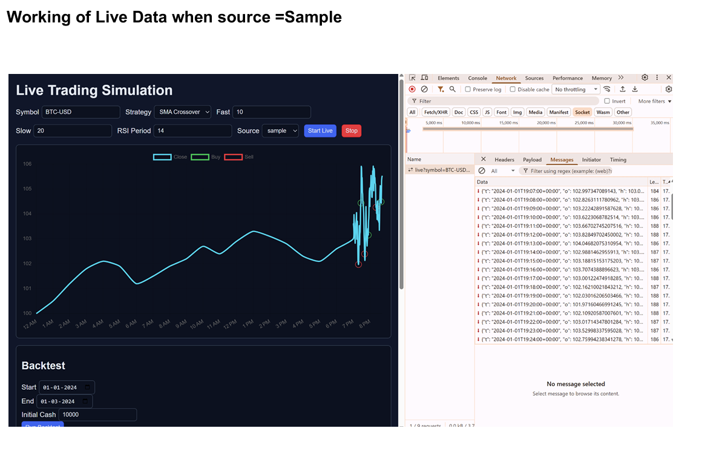
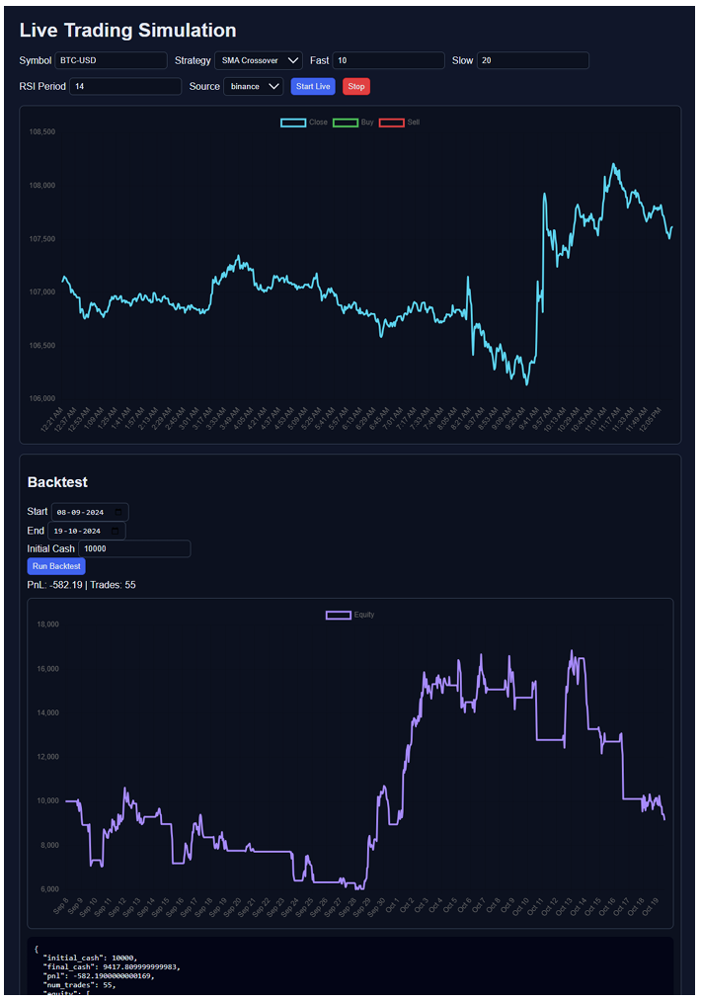
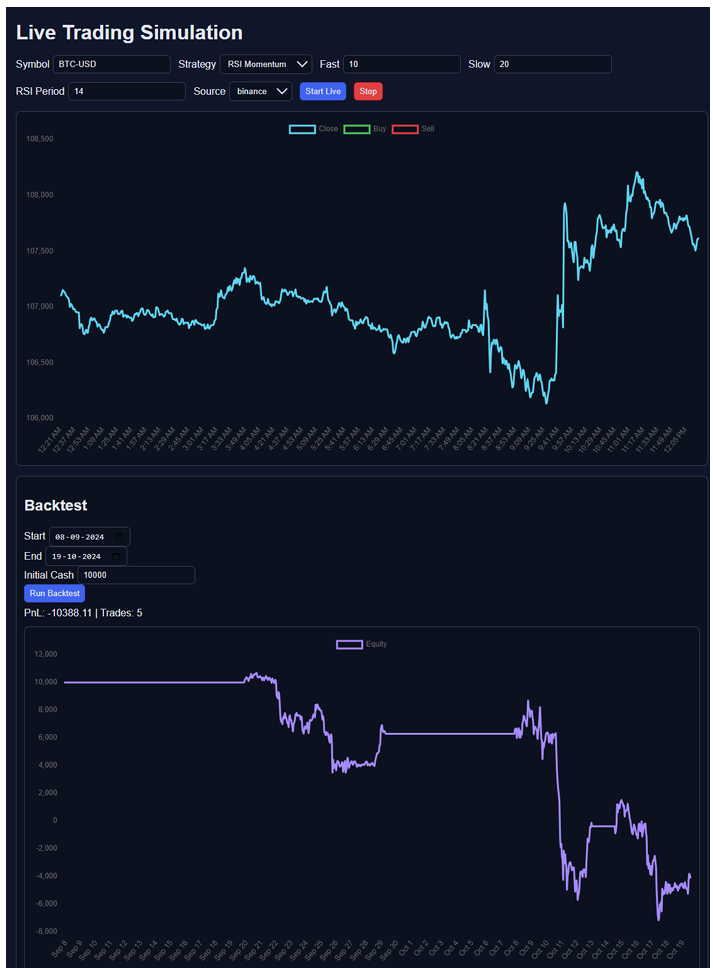

Live Trading Simulation / Algo Trading System Prototype

Overview

This project provides a minimal end-to-end prototype of a trading system with:
- FastAPI backend (historical data via yfinance or bundled sample, mock live websocket)
- Two strategies: SMA crossover and RSI momentum
- Backtesting and paper-trading style execution with PnL tracking
- SQLite persistence for trades and portfolio equity snapshots
- Static HTML/JS dashboard (Chart.js) showing price, signals, and live updates

Folder Structure

- `backend/` — FastAPI app, strategies, backtesting, data, database
- `frontend/` — static HTML/CSS/JS dashboard
- `requirements.txt` — Python dependencies

Quick Start

1) Create and activate a virtual environment (recommended):

```bash
python -m venv .venv
.\.venv\Scripts\activate
```

2) Install dependencies:

```bash
pip install -r requirements.txt
```

3) Run the backend server:

```bash
uvicorn backend.main:app --reload --host 0.0.0.0 --port 8000
```

4) Open the dashboard:

Open `frontend/index.html` in your browser. By default it connects to `http://localhost:8000` REST and `ws://localhost:8000` websocket.

Notes

- Historical data is fetched via `yfinance` if network and the symbol exist. If fetching fails, the backend falls back to `backend/data/sample_data.csv`.
- The websocket provides a mock live feed (random-walk with drift seeded from the last known price), emitting OHLCV candles each second and strategy signals.
- Backtests run server-side; results, trades and equity curve can be viewed via the dashboard or API.

API Endpoints (Selected)

- `GET /api/historical?symbol=BTC-USD&interval=1m&lookback=7d` — historical candles JSON
- `POST /api/backtest` — run backtest; body:

```json
{
  "symbol": "BTC-USD",
  "strategy": "sma_crossover",
  "params": {"fast": 10, "slow": 20},
  "start": "2024-01-01",
  "end": "2024-03-01",
  "initial_cash": 10000
}
```

- `GET /api/trades` — list stored trades (SQLite)
- `GET /api/equity` — portfolio equity snapshots
- `WS /ws/live?symbol=BTC-USD&strategy=sma_crossover&fast=10&slow=20` — mock live candles with signals

Strategies

- `sma_crossover`: Buy when fast SMA crosses above slow SMA; sell/exit when crosses below.
- `rsi_momentum`: Buy when RSI crosses up from oversold; sell when RSI crosses down from overbought.

Run Tests/Examples

- Start the server and open the dashboard. Choose symbol (e.g., `BTC-USD` or `AAPL`), pick strategy, and click Start Live to see the stream and signals. Use the Backtest form to run historical backtests.

### Working of Live Data (Source: Binance)


### Working of Live Data (Source: Sample)


### Backtest - SMA Crossover (Binance)


### Backtest - RSI Momentum (Binance)



Development Notes (200–300 words)

My development approach was structured and modular, beginning with a FastAPI backend to handle APIs and WebSockets, followed by integrating data providers (sample mock and Binance API), strategy logic, and backtesting features. I prioritized core functionality—historical data retrieval and strategy signals—before adding live streaming and a user-friendly frontend. Testing with sample data ensured stability, while Binance integration brought real-world applicability. The stateless design keeps it lightweight and scalable.
Technologies used include Python (FastAPI, Pandas, Websockets, Requests) for the backend, enabling efficient data processing and streaming. The frontend leverages HTML, JavaScript (with Chart.js for dynamic charts), and CSS, creating an interactive dashboard. Binance API provides live crypto data, complemented by synthetic generation in data_utils.py for flexible testing.
I successfully implemented timezone handling with UTC standardization, ensuring seamless DataFrame filtering, and established a reliable WebSocket connection to Binance for real-time updates. The modular structure—separating providers, strategies, and backtesting—allows easy addition of new features, like more strategies or data sources. The dashboard effectively visualizes live prices with signals and portfolio performance, including PnL and equity curves, enhancing user experience. This prototype demonstrates a solid foundation for algo trading simulation, showcasing the power of integrating real-time data with strategic analysis, and it’s primed for future enhancements in a live trading environment.


